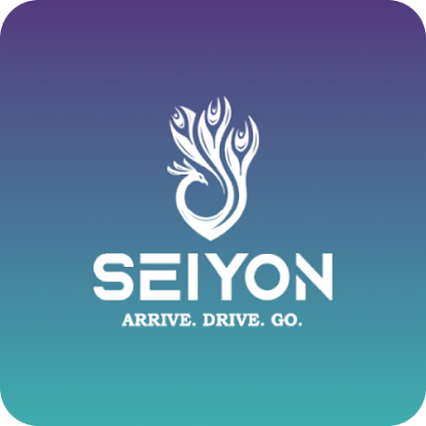
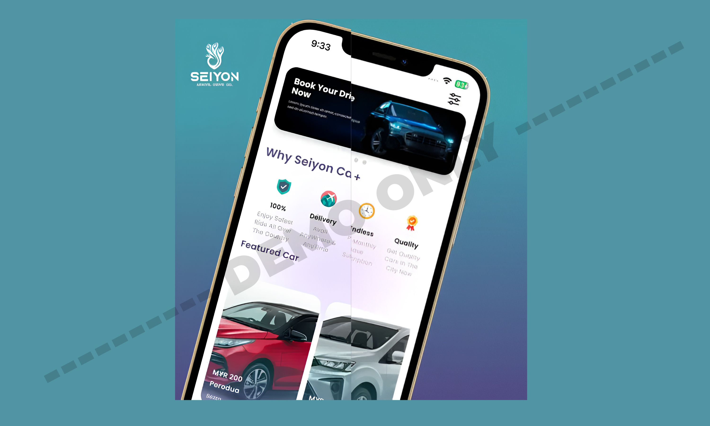
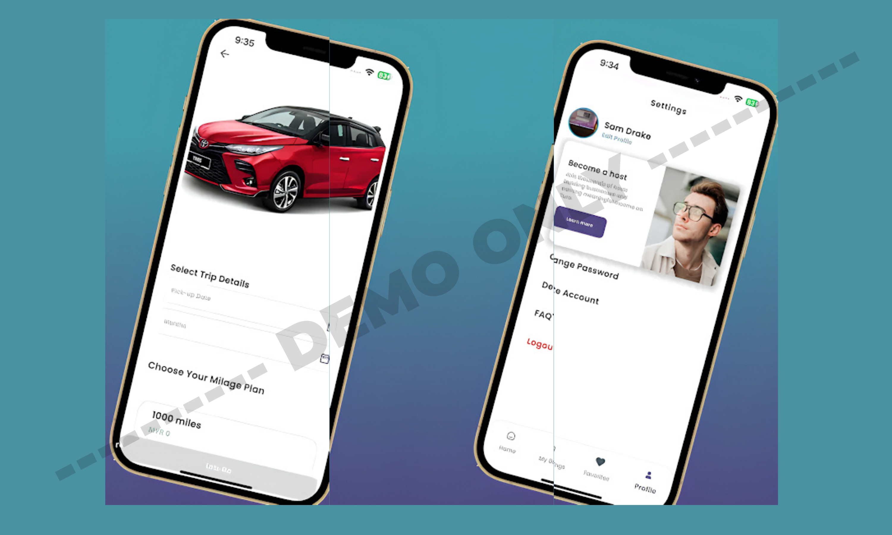

# 🚗 Seiyon Car Rental (For Demo Use Only)
### Industrial Portfolio — UI & Feature Contribution Showcase  
**Note:** This application belongs to **Seiyon Car Rental Malaysia**, developed during my time at **HBOX**.  
This repository is created **only for demo and presentation purposes** to showcase my contributions, UI previews, and involvement in the project.

---

## 📌 About the App

**Seiyon Car Rental** is a Malaysia-based mobile application that allows users to **browse, book, and manage car rentals** with a seamless digital experience.

The app enables:

- 🚘 Browsing available cars for rent  
- 🗓️ Booking cars by date & duration  
- 📍 Location-based car availability  
- 💳 Secure in-app payments  
- 🧾 Rental history & profile management  
- 🛠️ Smooth booking workflow designed for reliability  

This demo repository contains **only visual previews** — no production code or backend.

---

## 👨‍💻 My Role & Contributions

During my time at **HBOX**, I contributed actively to this project:

- 🐞 **Fixed critical UI/UX bugs** across multiple modules  
- 🚀 **Assisted with app preparation and final build submission** for both Play Store & App Store  
- 👨‍🏫 **Mentored a junior team member**, teaching architecture patterns & debugging approaches  
- 🔧 Improved UI consistency and component organization  
- 📱 Ensured smooth navigation and optimized performance on key screens  

This portfolio highlights the **UI flow, improvements, and project-level contributions** I made.

---

## 🧩 Demo Assets Included  

This repository contains **only the following items**:

- ✔ App Icon  
- ✔ Landscape showcase strips (multiple screens)  
- ❌ No source code  
- ❌ No backend implementation  
- ❌ No proprietary assets  

Everything is provided **strictically for portfolio demonstration**.

---

## 🖼️ Visual Preview

### **App Icon**

---

### **Showcase — Landscape Preview 1**

---

### **Showcase — Landscape Preview 2**

---

## 📥 Download (Official App Link)

> Note: This link belongs to the **official Seiyon Car Rental app**, not this portfolio demo.

**Google Play:**  
_(Android version available)_  
**Play Store Link:** [View it on Play Store](https://play.google.com/store/apps/details?id=com.hboxdigital.seiyonplus_app&hl=en)

**App Store:**  
Not available (Android-only release)

---

## 📄 Disclaimer

This repository is **not affiliated with, endorsed by, or officially representing Seiyon Car Rental, HBOX, or any associated parties**.  
It is intended **solely to demonstrate my UI development and project contributions**.  
All rights to the original application belong to **Seiyon Car Rental Malaysia**.

---

## 📬 Contact

For professional work, collaborations, or UI development:

**Email:** hamzabilalgaya.bilal@gmail.com  
**LinkedIn:** https://www.linkedin.com/in/hamza-bilal-g-4259a8181  
**Fiverr:** https://www.fiverr.com/s/EgZdxBK  
**Upwork:** https://www.upwork.com/freelancers/~01474d05eaa4a6e38b

---

## ⭐ Support My Work

If you like my work and want to support future UI components, tutorials, and open-source contributions:

### ☕ **Buy Me a Coffee**  

